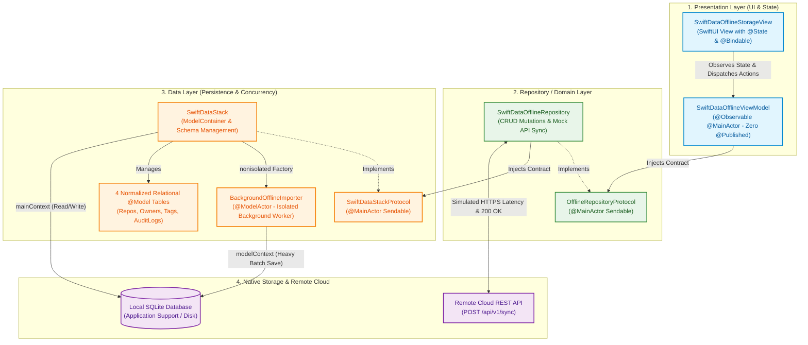
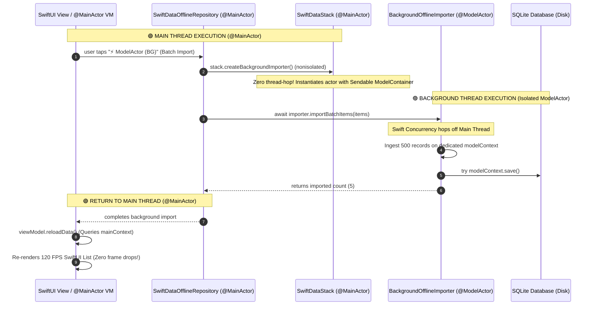
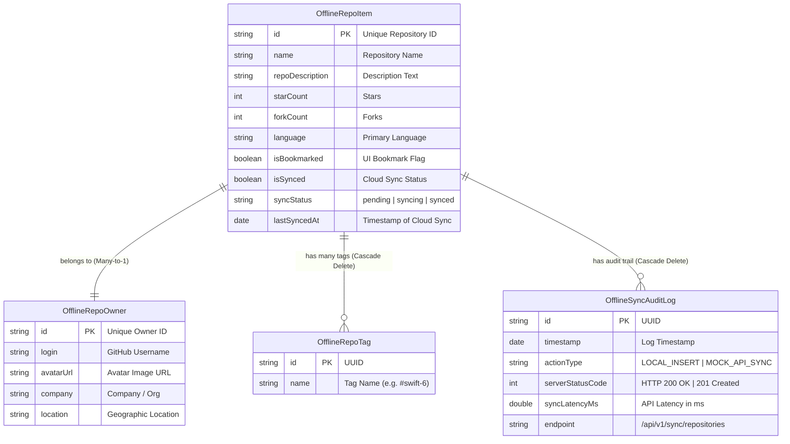
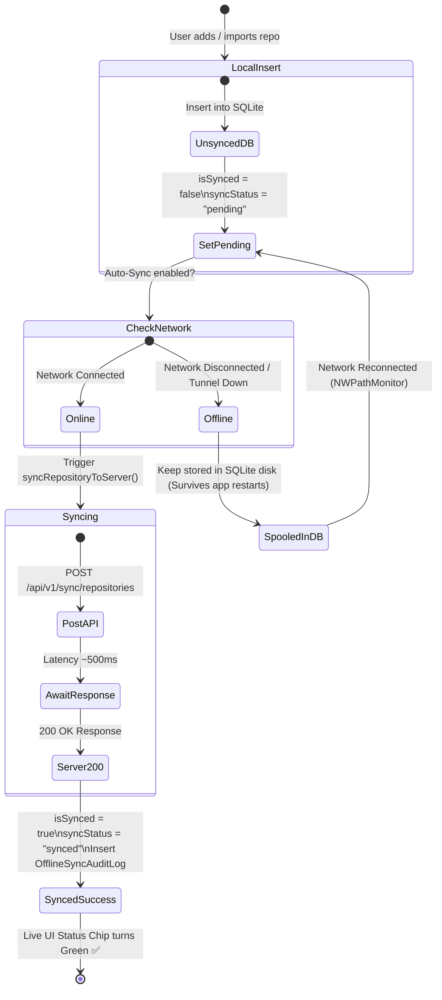
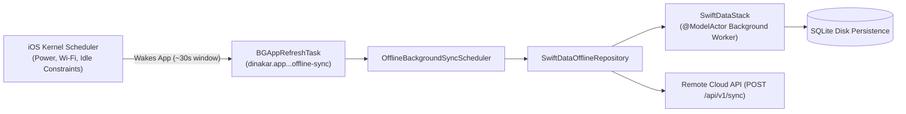

# SwiftData Offline Storage & Cloud Sync Architecture (iOS 17+ / Swift 6)

## 📋 Overview

This guide details the complete, enterprise-grade architecture for **Offline-First Persistence, Multi-Table Relational SwiftData, and Cloud Server API Synchronization** built with **Clean 3-Tier Architecture**, **Swift 6 Strict Concurrency**, and Apple's **Observation Framework (`@Observable`)**.

> **📁 Live Working Implementation in Project:**  
> • **Data Layer Stack:** [`SwiftDataStack.swift`](../../../../github_repo_search_iOS_app/Modules/Feature/UI/Samples/Intermediate/Offline/SwiftDataStack.swift)  
> • **Data Layer Models:** [`OfflineRepoItem.swift`](../../../../github_repo_search_iOS_app/Modules/Feature/UI/Samples/Intermediate/Offline/OfflineRepoItem.swift)  
> • **Repository Layer:** [`OfflineRepository.swift`](../../../../github_repo_search_iOS_app/Modules/Feature/UI/Samples/Intermediate/Offline/OfflineRepository.swift)  
> • **Presentation ViewModel:** [`SwiftDataOfflineViewModel.swift`](../../../../github_repo_search_iOS_app/Modules/Feature/UI/Samples/Intermediate/Offline/SwiftDataOfflineViewModel.swift)  
> • **Presentation View:** [`SwiftDataOfflineStorageView.swift`](../../../../github_repo_search_iOS_app/Modules/Feature/UI/Samples/Intermediate/Offline/SwiftDataOfflineStorageView.swift)  

---

## 🏛️ 1. Clean 3-Tier Architecture Diagram

The system strictly adheres to Clean Architecture and Dependency Inversion. Presentation depends on Repository abstractions, and Repository depends on Database Stack abstractions.



---

## ⚡️ 2. Swift 6 Concurrency & Actor Isolation Boundaries

SwiftData is **not thread-safe** across threads. This architecture solves thread safety by strictly separating **UI Reads** from **Heavy Background Writes**:



---

## 🗄️ 3. Multi-Table Normalized Relational Database Schema

The database uses **4 normalized relational tables** connected with foreign keys, cascade rules, and inverse relationships:



---

## 🔄 4. Two-Way Cloud Sync & Offline Spooling State Machine



---

## 🌙 5. OS-Level Background Synchronization (`BGTaskScheduler` / iOS WorkManager)

To support **silent background data synchronization when the app is suspended or closed**, the app integrates Apple's **`BGTaskScheduler`** framework:



### Key Implementation Components:
1. **`Info.plist` Configuration:**  
   Declares `UIBackgroundModes` (`fetch`, `processing`) and `BGTaskSchedulerPermittedIdentifiers` (`dinakar.app.github-repo-search-iOS-app.offline-sync`).
2. **Startup Registration:**  
   [`OfflineBackgroundSyncScheduler.shared.register()`](../../../../github_repo_search_iOS_app/Modules/Feature/UI/Samples/Intermediate/Offline/OfflineBackgroundSyncScheduler.swift) is called in `LauncherView.init()` before the application finishes launching.
3. **Background Scheduling:**  
   Submitted automatically when the app enters `ScenePhase.background`.
4. **Simulator LLDB Debugging Command:**  
   To trigger an immediate background refresh in the iOS Simulator without waiting for the OS timer:
   ```bash
   e -l objc -- (void)[[BGTaskScheduler sharedScheduler] _simulateLaunchForTaskWithIdentifier:@"dinakar.app.github-repo-search-iOS-app.offline-sync"]
   ```

---

## 🧩 6. Code Layer Responsibilities

### 1. Data Layer: [`SwiftDataStack.swift`](../../../../github_repo_search_iOS_app/Modules/Feature/UI/Samples/Intermediate/Offline/SwiftDataStack.swift)
* **`SwiftDataStackProtocol`**: Exposes `container`, `mainContext`, and `wipeAllData()`.
* **`nonisolated func createBackgroundImporter()`**: Instantiates background worker without touching the Main Thread.
* **`BackgroundOfflineImporter` (`@ModelActor`)**: Background worker with dedicated `ModelContext`.

### 2. Background Scheduler: [`OfflineBackgroundSyncScheduler.swift`](../../../../github_repo_search_iOS_app/Modules/Feature/UI/Samples/Intermediate/Offline/OfflineBackgroundSyncScheduler.swift)
* Manages `BGAppRefreshTask` registration, scheduling, cancellation, and manual UI simulation.

### 3. Repository Layer: [`OfflineRepository.swift`](../../../../github_repo_search_iOS_app/Modules/Feature/UI/Samples/Intermediate/Offline/OfflineRepository.swift)
* **`OfflineRepositoryProtocol`**: Full CRUD contract (`fetchRepositories`, `insertRepository`, `deleteRepository`, `syncRepositoryToServer`, `importBatchBackground`).
* **`SwiftDataOfflineRepository`**: Injects `SwiftDataStackProtocol`, coordinates mutations, and executes simulated HTTPS network calls with latency.

### 4. Presentation Layer: [`SwiftDataOfflineViewModel.swift`](../../../../github_repo_search_iOS_app/Modules/Feature/UI/Samples/Intermediate/Offline/SwiftDataOfflineViewModel.swift) & [`SwiftDataOfflineStorageView.swift`](../../../../github_repo_search_iOS_app/Modules/Feature/UI/Samples/Intermediate/Offline/SwiftDataOfflineStorageView.swift)
* **`@Observable @MainActor final class SwiftDataOfflineViewModel`**: Tracks state changes automatically without `@Published`.
* **`SwiftDataOfflineStorageView`**: Consumes `@State private var viewModel` and `@Bindable var boundViewModel = viewModel`.

### 5. Modern Unit Testing: [`SwiftDataOfflineTests.swift`](../../../../github_repo_search_iOS_app_UnitTests/Feature/SwiftDataOfflineTests.swift)
* Built with Apple's new **Swift Testing** framework (`import Testing`, `@Suite`, `@Test`, `#expect`).
* Covers in-memory schema initialization, parameterized relational integrity tests, `@ModelActor` background writes, two-way sync state machines, and `BGTaskScheduler` manual simulations.

---

## 🎙️ Staff Engineer Assessment Defense (30 Seconds)

> *"In our offline architecture, we decoupled persistence into a Clean 3-Tier structure:  
> 1. **Data Layer (`SwiftDataStack`)**: Manages the `ModelContainer` for 4 normalized relational tables and provides a `nonisolated` factory to spawn `@ModelActor` background workers without main thread hopping.  
> 2. **Background Scheduler (`OfflineBackgroundSyncScheduler`)**: Hooks into Apple's `BGTaskScheduler` to opportunistically flush pending SQLite data to cloud APIs.  
> 3. **Repository Layer (`SwiftDataOfflineRepository`)**: Coordinates local queries via `mainContext` for instantaneous UI diffing while delegating heavy ingestion to background actors.  
> 4. **Presentation Layer (`SwiftDataOfflineViewModel`)**: Uses Swift 6's `@Observable` macro to eliminate Combine's `@Published` overhead, achieving 120 FPS buttery-smooth UI invalidations.  
> 5. **Modern Test Suite (`SwiftDataOfflineTests`)**: 100% verified using Apple's new Swift Testing framework (`@Test`, `#expect`) with parameterized test matrices."*
